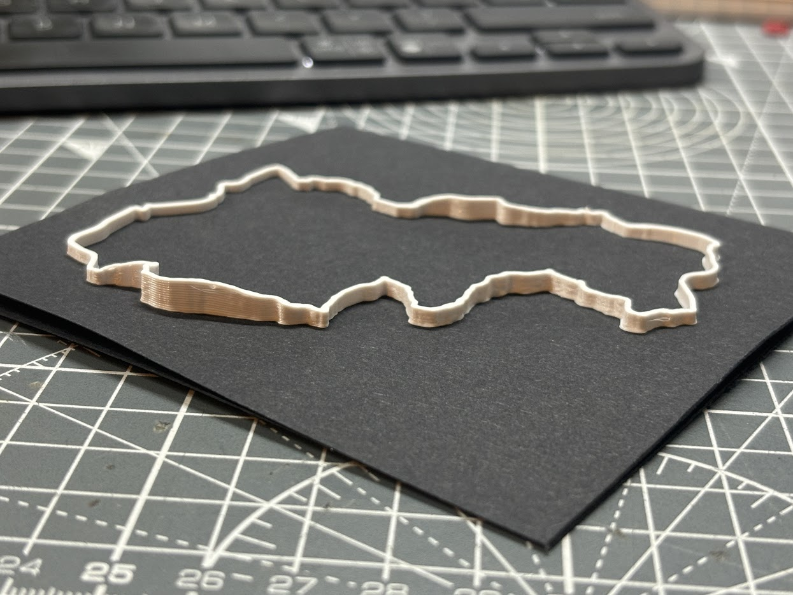

# gpx2gcode
> Non-planar printing for non-planar cycling

Just a little IPython Notebook for converting gpx data from bike rides into raw G-code.

Built using the lovely [FullControl Library](fullcontrol.xyz).

> [!WARNING]  
> This is work in progess and may be a bit rough around the edges

See the notebook for some instructions

## My Setup:
- Prusa Mini 0.8mm nozzle
- White PLA on black card
- I use magnets to hold the card down
- Normally I print one layer onto the build plate to work out where it will be, then cancel the print and start again for paper placement.
- The print will pause after an initial purge, I pull away the purged material then place my card down with magnets.
- Magnets need to be moved around during the first layer by hand

## TODO:
- [ ] Sort out altitude scale
- [ ] Way to select nozzle diameter
- [ ] Instructions on getting GPX data
- [ ] Pen plot roads/topology?
